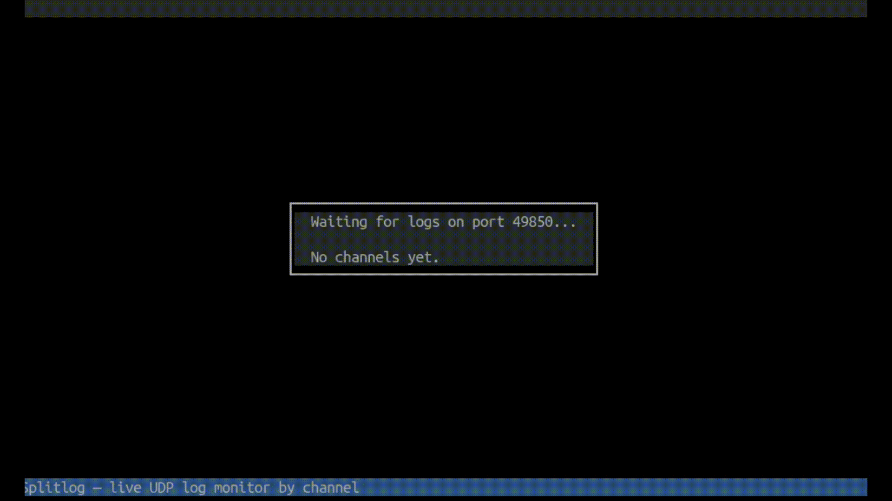

# splitlog

> A developer tool that supercharges [`debug`](https://www.npmjs.com/package/debug) by routing logs over UDP and visualizing them in a multi-pane CLI interface.

**splitlog** helps separate and monitor logs from multiple services or modules with ease by using logical channels, dynamic port mapping, and structured JSON output.

---

## Features

- **Tiny Logging Library**  
  Pipe logs over UDP with ease, from any `debug` logger.

-  **CLI Log Monitor**  
  Real-time multi-tab terminal UI using [`blessed`](https://github.com/chjj/blessed), showing logs per channel.

- **Channel Registry**  
  Auto-discovers ports via a naming registry (`/tmp/splitlog_channel`), so clients don’t need to know port info up front.

-  **JSON Mode**  
  Supports structured logging for better parsing and formatting.

---

## Use Cases

- 🧩 Multi-service debugging
- 🔀 Frontend/backend log separation
- 🧹 Cleaner, isolated dev environments
- 🧪 Live observation of microservices or workers

---



---

## Installation

```bash
npm install @dsheiko/splitlog
```


---

## CLI Monitor

Start a UDP listener and terminal UI for logs:

```bash
splitlog
```

### Options

```bash
-p, --port <number>    UDP port to listen on (defaults to first available port)
```

The CLI will automatically:

* Start a UDP listener
* Register the port in `/tmp/splitlog_channel`
* Show logs grouped by channels in separate panes

---

## Logger Usage

```js
import debug from "debug";
import splitlog from "@dsheiko/splitlog";

const logApp = splitlog( debug( "APP" ) );
const logDb = splitlog( debug( "DB" ) );
const logError = splitlog( debug( "ERROR" ) );

logApp( "Application started" );
logDb( "Connected to database" );
logError( "Failed to fetch user data", { userId: 42, error: "User not found" } );
```

### API

```ts
splitlog( debugNamespaceLogger: Function, options?: {
  port?: number,
  host?: string
} ): Function
```

If no `options` are provided, the logger reads the current listener port from `/tmp/splitlog_channel`.


---

## Contributing

PRs welcome! If you want to suggest a feature or report a bug, please open an issue.
